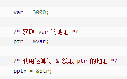

# C&C++

## 基本语法

### 指针

1. 定义： int* p = &a   p表示地址，相当去&a， *p表示指向对象值，相当于a。
2. 数组指针：int* p[n] = &a[n]

3. 指向指针的指针：


 



4. 指针作为返回值

这里返回的是a/b的地址

这里a，b不能是局部变量，需要时外部变量或static局部变量


### const

C语言定义数组不能使用const定义（C++可以），需要改成#define

```c
const int num = 10;
int a[num]; // error
#define num 10
int a[num]; // right
```

### 计算时间

```C++
#include<time.h>

clock_t start = clock();
clock_t end = clock();
std::cout << "Running time(s):" << (double)(end - start) / CLOCKS_PER_SEC << endl;
// CLOCKS_PER_SEC:CPU一秒钟运行的时钟周期数
```

### main函数参数调用

可以在执行程序时，获取命令行的输入。

argc表示输入的个数，输入用空格相隔。 argv[]储存输入的参数。

```c++
int main(int argc, const char *argv[]) {
  for (size_t i = 0; i < argc; i++) {
    std::cout << argv[i] << std::endl;
  }
  return 0;
}
```

输出结果：

```shell
g++ -o main main.cpp
./main 1 "hello" 1.233
# 输出
1
hello
1.233
```

### 内存释放

C语言中是free函数，可以释放由 [malloc()](http://c.biancheng.net/cpp/html/137.html)、[calloc()](http://c.biancheng.net/cpp/html/134.html)、[realloc()](http://c.biancheng.net/cpp/html/2859.html) 分配的内存空间，以便其他程序再次使用。单纯静态数据的内存不能释放。类似于C++中的new与delete操作。

```c
#include <stdlib.h>
free(ptr); // 释放内存，但不会改变指针的指向。
ptr = NULL; // 手动重置指针，防止误用。
```

## OOP面向对象

### 运算符重载

- 1、运算重载符不可以改变语法结构。
- 2、运算重载符不可以改变操作数的个数。
- 3、运算重载符不可以改变优先级。
- 4、运算重载符不可以改变结合性。

```c++
// 语法
类型 operator 被重载运算符（类型 变量）
// 重载+
Box operator+(const Box&, const Box&);
// 重载[]
int& operator[](int i)
{
  if( i > SIZE ){
    cout << "索引超过最大值" <<endl; 
    // 返回第一个元素
    return arr[0];
    }
  return arr[i];
}
```

### 模板

#### 函数模板

避免函数重载带来的重复工作。

```c++
template<typename 数据类型参数标识符>
<返回类型><函数名>(参数表)
{
    函数体
}
// 数字交换函数模板
template<typename T> T swap(T x, T y);
// compare
template<typename T> int compare(const T& x, const T& y);
```

#### 类模板

不能推断参数模板类型。

```c++
template <typename T> class class-name {
  T& func();
    ...
}
// 例如
template <typename T> class Blob {};
// 对成员函数
template <typename T> T Blob<T>::func();
// 返回类型为引用或指针
template <typename T> T& Blob<T>::func();

// 调用时
class class-name<类型> 类变量
// 例如,类中以T&为类型的，会被替换成int
class Blob<int> name
```

## 回调函数


一般程序运行时，应用程序会常常通过API调用库里所预先准备好的函数。 但是有些库函数却要求应用程序先传给它一个函数，以在合适的时候调用完成任务。这个被传入的、后又被调用的函数就称为**回调函数**（callback function）。

个人理解：中间函数（库函数）通常都是封装好了，只提供了对应的API，API中具有回调功能。这样通过应用层面自己编写回调函数，就会比什么函数都封装在中间函数里面更灵活。

左边的call：把回调函数传入库函数的动作，称为登记回调函数。下方代码中传入getDouble或getQuadruple函数。

右边的call：响应回调函数。下方代码中(*getEvenNumber)调用getDouble或getQuadruple函数。

```c++
int getDouble(int x) {
  return x * 2;
}

int getQuadruple(int x) {
  return x * 4;
}

// 第二个参数传入函数
int getOddNumber(int x, int (*getEvenNumber)(int x)) {
  return 1 + (*getEvenNumber)(x);
}

int main(int argc, const char *argv[]) {
  int x = 3;
  std::cout << "x is:" << x << std::endl;

  // 生成2k+1奇数
  std::cout << "2 Times odd number is:" << getOddNumber(x, getDouble) << std::endl;

  // 生成4k+1奇数
  std::cout << "4 Times odd number is:" << getOddNumber(x, getQuadruple) << std::endl;
  
  return 0;
}
```

输出：

``` shell
x is:3
2 Times odd number is:7
4 Times odd number is:13
```

### 面向对象 Callback

本Case为Boss读取并设置财务数据。

其中，Boss为应用程序，Fiance为中间函数，而CallBack为回调函数类。

1. CallBack定义了一个接口，需要在应用对象Application函数中重写实现。
2. 当Application调用库函数（里面有callback函数）时，需要将Application传入库函数，以便调用回调函数。

```C++
// 参考https://blog.csdn.net/qq_29924041/article/details/74857469

#include <iostream>

// 回调函数类
class CallBack {
  public:
  virtual int getEvenNumber(int x) const = 0;
};

// 库函数类
class Compute {
  public:
  // ! 调用Application中重写的回调函数
  Compute(CallBack *mcallback)
      : mcallback_(mcallback) {
  }
  ~Compute() {
  }

  // 被调用的库函数
  int getOddNumber(int x) {
    int temp = 0;
    if (mcallback_ != NULL) {
      temp = mcallback_->getEvenNumber(x);
    }
    return 1 + temp;
  }

  private:
  CallBack *mcallback_;
};

// 应用函数类
class Application : public CallBack {
  public:
  Application() {
    // ! 关键，将自身传入库函数，相当于登记回调函数。
    mcompute_ = new Compute(this); 
  }
  ~Application() {
    if (mcompute_ != NULL) {
      delete mcompute_;
      mcompute_ = NULL;
    }
  }

  // 编写函数调用库函数
  void getNumber(int x) {
    int res = mcompute_->getOddNumber(x);
    std::cout << res << std::endl;
  }

  // 自定义回调函数，可以是2×k，4×k等。
  int getEvenNumber(int x) const {
    // return x * 2;
    return x * 4;
  };

  private:
  Compute *mcompute_;
};

int main(int argc, const char *argv[]) {
  int x = 3;

  Application test;

  test.getNumber(x);

  return 0;
}
```

## 多线程

多线程是多任务处理的一种特殊处理形式，多任务处理允许让电脑同时运行两个或两个以上的程序。通常分为：基于进程或基于线程。

<https://www.bogotobogo.com/cplusplus/multithreading_pthread.php>

```c++
#include <pthread.h>
// 创建线程
pthread_create (thread, attr, start_routine, arg);
// 退出线程
pthread_exit(status);
```

## 常见错误

- g++编译时出现问题。

  原因及解决办法：主要是没有在cpp文件中实现构造函数和析构函数。(空的构造函数也要写，不能只在h文件中实现。)

  main.o: In function `main':

  main.cpp:(.text+0x20): undefined reference to 构造函数和析构函数

