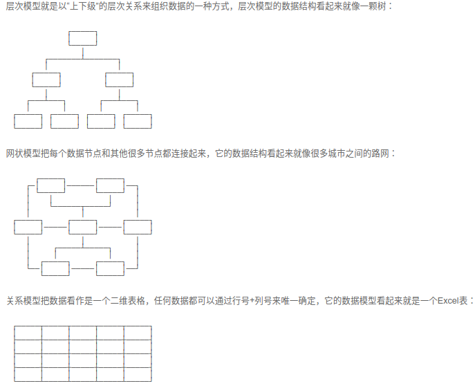

# SQL

数据库作用：保存用户数据。常用保存方法：csv, word...

如果每个应用程序都各自写自己的读写数据的代码，一方面效率低，容易出错，另一方面，每个应用程序访问数据的接口都不相同，数据难以复用。

所以，数据库作为一种专门管理数据的软件就出现了。应用程序不需要自己管理数据，而是通过数据库软件提供的接口来读写数据。至于数据本身如何存储到文件，那是数据库软件的事情，应用程序自己并不关心.

SQL是结构化查询语言Structured Query Language的缩写，用来访问和操作数据库系统。SQL语句既可以查询数据库中的数据，也可以添加、更新和删除数据库中的数据，还可以对数据库进行管理和维护操作。不同的数据库，都支持SQL。

## 规范

SQL不区分大小写，但规范：SQL关键字总是大写，以示突出，表名和列名均使用小写。

## 数据模型

层次/网状/关系模型，关系模型应用最广泛。

目前，主流的关系数据库主要分为以下几类：

1. 商用数据库，例如：[Oracle](https://www.oracle.com/)，[SQL Server](https://www.microsoft.com/sql-server/)，[DB2](https://www.ibm.com/db2/)等；

2. 开源数据库，例如：[MySQL](https://www.mysql.com/)，[PostgreSQL](https://www.postgresql.org/)等；

3. 桌面数据库，以微软[Access](https://products.office.com/access)为代表，适合桌面应用程序使用；

4. 嵌入式数据库，以[Sqlite](https://sqlite.org/)为代表，适合手机应用和桌面程序。

## MySQL

[廖雪峰教程](https://www.liaoxuefeng.com/wiki/001508284671805d39d23243d884b8b99f440bfae87b0f4000/00150916716600634d1020c90304a6aaa5f37248006f900000)

# ORM

参考：http://www.ruanyifeng.com/blog/2019/02/orm-tutorial.html

面向对象编程把所有实体看成对象（object），关系型数据库则是采用实体之间的关系（relation）连接数据。很早就有人提出，关系也可以用对象表达，这样的话，**就能使用面向对象编程，来操作关系型数据库**。

**ORM 就是通过实例对象的语法，完成关系型数据库的操作的技术，是"对象-关系映射"（Object/Relational Mapping） 的缩写。**

- 数据库的表（table） --> 类（class）

- 记录（record，行数据）--> 对象（object）

- 字段（field）--> 对象的属性（attribute）

### 优缺点

优点：

- 数据模型都在一个地方定义，更容易更新和维护，也利于重用代码。

- ORM 有现成的工具，很多功能都可以自动完成，比如数据消毒、预处理、事务等等。

- 它迫使你使用 MVC 架构，ORM 就是天然的 Model，最终使代码更清晰。

- 基于 ORM 的业务代码比较简单，代码量少，语义性好，容易理解。

- 你不必编写性能不佳的 SQL。

缺点：

- ORM 库不是轻量级工具，需要花很多精力学习和设置。
- 对于复杂的查询，ORM 要么是无法表达，要么是性能不如原生的 SQL。
- ORM 抽象掉了数据库层，开发者无法了解底层的数据库操作，也无法定制一些特殊的 SQL。
