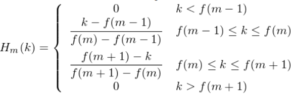

# TODO

1. 补充pca内容
2. 补充mobilenetv2内容。

# Machine Learning

## Linear Regression

### 多元线性回归

线性回归公式如下：

x和y为给定数据，ypred为拟合数据。
$$
y_{pred} = a_0 + a_1*x_1 + a_2*x_2 + ...+ a_n*x_n
$$
损失函数loss：

采用MSE（Mean Square Error）协方差进行计算：

目的是需要是找到最合适的参数a，使得MSE的值最小。
$$
MSE = \frac{1}{n}\sum_{i=1}^n(y_{pred}-y)^2=  \frac{1}{n}\sum_{i=1}^n(a_0 + a_1*x_1 + a_2*x_2 + ...+ a_n*x_n-y)^2 \\
error = y_{pred}-y
$$
通常有两种方法：梯度下降和最小二乘法。

### 梯度下降

梯度下降通过不断学习迭代参数a，使得MSE的值最小。对ypred对系数a求偏导：
$$
\frac{\partial y}{\partial a_i} = \frac{2}{n}\sum_{i=1}^n(y_{pred}-y)*x_i (i=0,x_i=1)
$$
根据MSE变化，更新系数a：
$$
a_i = a_i - \alpha * \frac{\partial y}{\partial a_i} = a_i - \alpha *\frac{2}{n}\sum_{i=1}^n(y_{pred}-y)*x_i = a_i - \alpha *\frac{2}{n}\sum_{i=1}^nerror*x_i
$$
其中alpha为学习速率，过大容易无法收敛，过小则会训练过慢。

###　随机梯度下降

随机梯度下降，不需要计算全部error的和，时时更新迭代a系数。得到的不一定是全局最优解，但计算速度较快。alpha可以适当取小。

公式为：

直接判断error小于某个值，则可以进行下次epoch迭代。
$$
a_i = a_i - \alpha * \frac{\partial y}{\partial a_i} = a_i - \alpha *\frac{2}{n}(y_{pred}-y)*x_i = a_i - \alpha *\frac{2}{n}*error*x_i
$$

### 最小二乘法

最小二乘法是直接通过公式计算出a的结果，而不进行跌大。当数据较大时，计算复杂度要远大于梯度下降。

## 特征缩放

在进行梯度下降过程中，多元线性回归会出现不同元数据的取值范围不同，导致loss函数的偏导对不同的数据影响不一致，很难达到收敛。需要x数据进行特征缩放，使得取值范围均在-1～1之间。

公式如下：
$$
x_{i-new} = \frac{x_i - x_{mean}}{x_{max} - x_{min}}
$$

### 标准化

- 基于正态分布的z分数标准化。要求假设数据符合正态分布。

$$
x_{i-new} = \frac{x_i - x_{mean}}{\sigma}
$$

sigma为标准差。

1. 经过z分数转化。高于平均数的变量会得到一个正的标准分，反之则为负的平均分。、
2. 转换后的数据，是符合标准正态分布的。（平均书为0,标准差为1）
3. 转换后的数据不容易受到噪音的数据的影响，并且保留了各维特征对目标函数的影响权重。

### 归一化

将数据转化为[0-1]，非常受噪音数据的影响。
$$
x_{i-new} = \frac{x_i - x_{min}}{x_{max} - x_{min}}
$$

### PCA

http://www.cnblogs.com/jerrylead/archive/2011/04/18/2020209.html

在信号处理中，信号通常具有较大的方差，噪音具有较小的方差。信噪比就是信号与噪音方差的比。

## 多项式线性回归Polynomial

用线性回归拟合多项式，在采用多元线性回归之前，需要对数据预先处理。

如针对degree为4的1D数据，进行降维转化为1degree数据，后续再使用多元线性回归。
$$
x \Rightarrow [1, x, x^2, x^3, x^4] = [1, x_1, x_2, x_3, x_4]
$$
若x为多维数据，则需要进行其它处理。

拟合结果如下：alpha=0.8, epochs = 1000


## 正则化

参考：<https://blog.csdn.net/jinping_shi/article/details/52433975>

正则化用于加在损失函数后面，可以看作是损失函数的惩罚项。

L1正则化可以产生稀疏矩阵，当正则化系数较小时候，可以避免过拟合。

L2正则化可以避免过拟合。

# Deep Learning


## 原理

### 普遍性Universality

参考：http://neuralnetworksanddeeplearning.com/chap4.html

**1.神经网络能计算任何连续公式function（对于离散公式不成立），只要提供对于该公式的input和output。**

左边的公式f(x)，可以通过右侧的神经网络计算而出。输入输出一定都只是一维。


DNN具有普遍性Universality.


2. 神经网络并不是准确计算出该公式，而是求得近似解，近似解的好坏程度由需求决定。

   通过增加隐藏神经元（hidden neurons）的数量，可以提高精确度。上图1 hidden layer， 5 hidden neurous。

### 构建DNN

下图是1 hidden layer，2 hidden neurons， activation function is sigmoid。
$$
\sigma(wx + b)\\ \sigma(z) = 1/(1+e^{-z})
$$


​     

单一参数构建，其中s = -b/w。表示当x大于s时，进行step跳远，output is 1.


多个step叠加成复杂的模型。


### 案例

求解function, x:0-1, y: 0-1
$$
f(x) = 0.2+0.4 x^2+0.3x \sin(15 x) + 0.05 \cos(50 x)
$$


1. 求解f(x)对应的反激活函数：$\ \sigma^{-1}*f(x) $ 

   

2. 调整参数w和b，s = -wb,使得DNN构建的函数与目标函数图形匹配。

   但是对于只有一层hidden layer的情况，想要匹配函数，需要很多的神经元。可以适当增加hidden layer的层数，能有效提升效果。Deep and thin layer makes better。

   

   3. 拓展：多维输入神经网络

      

## BackPropagation

### Scalar backpropagation

神经网络反向传播，梯度变化符合链式规则。


### 向量中的backpropagation


可以构建Jacobian矩阵进行运算，见dy/dx。

但是对于向量的后向传递而言，Jacobian矩阵是稀疏矩阵。转化成矩阵进行运算会占用极大的空间（上图，对于1xn向量，空间占用为nxn）。在实际计算后向传递时，需要进行implicit计算。即直接用数值乘法代替。见下图。


### 矩阵中的bachpropagation                                                                                                                                                  

对于矩阵x和w的反向传播，梯度计算公式如下：

同样不需要构建jacobin矩阵，需要大量空间，可以直接用矩阵进行计算。


Example：


## ConvNet

### 卷积运算

在神经网络中，可以不需要对卷积核进行翻转。翻转是实现可交换性，而在神经网络中，卷积通常不是单独存在的。卷积与其它运算结合的结果，本身就是不可交换的。
$$
(f*g)[n] = \sum_{m=-\infty}^{\infty} f[m]g[n-m] \\
= \sum_{m=-\infty}^{\infty} f[n-m]g[m]  (可交换性)
$$


#### 卷积性质


#### 计算layer参数

1. 先计算每个滤波器的参数（卷积核参数+偏置参数）。如卷积核为5x5x3的参数：5×5×3+1=76
2. 乘以深度，计算该layer总的参数。

### Pool


## MobileNetV2 模型

  keras API: https://keras.io/zh/applications/#mobilenetv2

  论文：https://arxiv.org/abs/1801.04381

  实现方式：https://github.com/ShuangXieIrene/mobilenet-v2

  知乎：https://zhuanlan.zhihu.com/p/35405071


核心特点：压缩模型深度，有效分解卷积，减小网络参数。可以有效降低运算量，但是精度下降得较少。

卷积分解是：标准卷积分解成一个深度卷积和一个点卷积（1 × 1卷积核）。**深度卷积将每个卷积核应用到每一个通道，而1 × 1卷积用来组合通道卷积的输出**

https://blog.csdn.net/Jesse_Mx/article/details/70766871

## InceptionV3模型

核心思想：用小卷积替代大卷积。共有46层，11个Inception模块。每个模块的输入经过不同尺寸的卷积filter，最后拼接在一起。

## RNN

特点：一条语句可以被视为RNN的一个输入样本，句子中的字或者词之间是有关系的，后面字词的出现要依赖于前面的字词。

缺点：容易出现反馈消失。


## LSTM

参考：<https://colah.github.io/posts/2015-08-Understanding-LSTMs/>

LSTM是为了解决RNN中的反馈消失问题而被提出的模型，它也可以被视为RNN的一个变种。与RNN相比，增加了3个门（gate）：input门，forget门和output门，门的作用就是为了控制之前的隐藏状态、当前的输入等各种信息，确定哪些该丢弃，哪些该保留，如下图所示。


## GRU

GRU只有两个门reset门r和update门，相比LSTM参数更少，优化运算量。实验证明，性能没有明显的胜者。


## Activation function


- sigmoid
  $$
  f(z) = \frac{1}{1+e^{-z}}
  $$
  特点：取值范围为0-1，适用于二分类。在特征相乘比较复杂或者相差不大时效果好。

  缺点：计算量大，反向传播计算梯度时，涉及除法，且容易出现梯度消失。

  sigmoid及其导数如下：

  

  

- tanh
  $$
  f(z) = \frac{e^z-e^{-z}}{e^z+e^{-z}} = 2*sigmoid(z)-1
  $$
  特点：-1-1之间，均值为0，在特征相差明显时效果较好，在循环过程中会不断扩大区别。实际时候比sigmoid好。

  缺点：计算量大

- ReLu
  $$
  f(z) = max(0,x)
  $$
  特点：收敛速度快。

  缺点：对于大信号没有限幅，容易出现梯度爆炸。

- softmax
  $$
  f(z) = \frac{e^{z_j}}{\sum_{k=1}^K e^{z_k}}
  $$
  特点：相当于求子类的概率，适用于多分类问题。

## loss function

- Cross Entropy 交叉熵
  $$
  loss = -\sum_x p(x)*log*q(x)
  $$
  交叉熵用于计算概率之间的loss，其中p为实际概率，q为预测概率。

- MSE 均方根值
  $$
  MSE = \frac{1}{n}\sum_{i=1}^n(y_{pred}-y)^2
  $$
  常用于回归问题，计算具体数值之间的loss。

## Optimizer 优化器

知乎参考：https://zhuanlan.zhihu.com/p/32626442

简书参考：<https://www.jianshu.com/p/aebcaf8af76e>

- SGD
  $$
  \theta_{n+1} = \theta_n - \frac {\alpha}{\alpha \theta_n}J(\theta_n)
  $$
  特点：随机梯度下降，得到部分数据的局部最优解。GD得到所有数据的局部最优解。

  缺点：迭代慢。

- RMSProp

  Geoffrey Hinton教授提出，主要是结合梯度平方的指数的移动平均数调整学习速率。

  在不稳定情况下，仍能收敛，适应性好。

  

- AdaGrad

  

  特点：动态改变梯度（学习速率），增加自适应性。

  缺点：主要缺陷来自分母项的对梯度平方不断累积，随之时间步地增加，分母项越来越大，最终导致学习率收缩到太小无法进行有效更新。

- Adam

  结合RMSProp和AdaGrad的优点。能够从梯度均值及梯度平方两个角度进行自适应地调节，而不是直接由当前梯度决定。

  

## 评估矩阵

# Audio & Speech Recognition

librosa提供的所有音频特征提取方式：

http://aqibsaeed.github.io/2016-09-03-urban-sound-classification-part-1/

   # MFCC

   MFCC： Mel Frquency Cepstral Coefficients

   Tutorial：http://practicalcryptography.com/miscellaneous/machine-learning/guide-mel-frequency-cepstral-coefficients-mfccs/

## 作用

有效提取音频的特征，提取音频中包含有效的语言语句，去除噪音和情感的干扰。

人类产生的语音，经过了声道（包括舌头，牙齿等）的filter。这些filter决定最终产生的声音。如果我们能人为的准确重塑这些filter，就可以准确的产生对应的音位。声道的filter本质上表示这些短时间音频信号的频谱能量的包络，MFCC则能准确的表示出这些包络。

   ## 计算步骤

   1. 将信号长度统一至20-45ms左右，通常25ms。

   2. 计算信号的频谱能量，DFT或FFT，需要加入window，如Hamming，Hanning等.

   3. Compute the Mel-spaced filterbank. 该滤波器为20-40（通常是26）个三角滤波器，之后将其应用至第2步计算的频谱中。通过Mel-spaced filterbank，可以将原信号频谱分隔开。

      

      4. 应用Mel-Scale计算第3步得到的26个(20-40)频谱能量，得到26个filterbank energe。
         $$
         M(f) = 1125ln(1+f/700)\\
         M^{-1}(m) = 700exp(m/1125-1)
         $$

      5. 计算第4步得到log filerbanks的Discrete Cosine Transform (DCT，离散余弦变换)，获得26个频谱系数。对于ASR（Automatic Speech Recognition ）来说，通常取前12或前13个系数即可。

   ### 计算Mel-spaced filterbank

   举例：300-8000Hz的10个filterbanks，需要12个点。

   1. 使用Mel-Scale公式，计算300-8000Hz内的10个线性点

      ```
      m(i) = 401.25, 622.50, 843.75, 1065.00, 1286.25, 1507.50, 1728.74, 1949.99, 2171.24, 2392.49, 2613.74, 2834.99
      ```

2. 再转化为Hz.

   ```
   h(i) = 300, 517.33, 781.90, 1103.97, 1496.04, 1973.32, 2554.33, 
          3261.62, 4122.63, 5170.76, 6446.70, 8000
   ```

3. round those frequencies to the nearest FFT bin. This process does not affect the accuracy of the features

   ```
   # 取fft size=512, samplerate=16000Hz
   f(i) = floor((nfft+1)*h(i)/samplerate)
   # 结果为：
   f(i) =  9, 16,  25,   35,   47,   63,   81,  104,  132, 165,  206,  256
   ```

4. filterbanks，每一个filterbank 起于前一个点，在该点（300,8000两点都是起止点）到达峰值，在下一个点又到达0.计算公式如下：

   f(m)表示当前点频率对应的bin值。

   


# 软件库安装

## opencv

官方安装说明：<https://docs.opencv.org/4.0.0/d7/d9f/tutorial_linux_install.html>

需要补充：

```shell
cmake -D CMAKE_BUILD_TYPE=RELEASE -D CMAKE_INSTALL_PREFIX=/usr/local -D BUILD_PYTHON_SUPPORT=ON ..  

sudo make install  

export LD_LIBRARY_PATH=/home/joe/Desktop/open_sources/opencv/build/lib:$LD_LIBRARY_PATH  

sudo ldconfig  

pkg-config opencv –libs  
```

对应cmake，参考: <https://docs.opencv.org/4.0.0/db/df5/tutorial_linux_gcc_cmake.html>

```cmake
cmake_minimum_required(VERSION 2.8)
project(DisplayImage)
set(CMAKE_CXX_STANDARD 11) # 这里编译选项设置为了C++ 11，不选择这个容易出错。
set(CMAKE_CXX_STANDARD_REQUIRED ON)

find_package(OpenCV REQUIRED)
include_directories(${OpenCV_INCLUDE_DIRS}) # 库文件位置:"/usr/local/include/opencv4"
add_executable(DisplayImage DisplayImage.cpp)
target_link_libraries(DisplayImage ${OpenCV_LIBS})
```

# Tensorflow 学习笔记

主要记录tensorflow笔记，问题以及代码实现等。

## Basic

查看图形可视化：`tensorboard --logdir="absolute/path/to/log_dir"`

### checkpoints

在tensorflow中checkpoints文件是一个二进制文件，用于存储所有的weights,biases,gradients和其他variables的值。

.meta文件则用于存储 graph中所有的variables, operations, collections等。简言之一个存储参数，一个存储图。

### Graph

<https://zhuanlan.zhihu.com/p/31308381>

## 参考资料

1. https://github.com/Joeseph5/TensorFlow-Course#basics
2. TensorFlow 实战Google深度学习框架 第2版 ,郑泽宇
3. tensorflow-internals
4. 神经网络可视化交互：http://playground.tensorflow.org


# Keras

## 文件保存与载入

### 保存模型文件

参考：https://keras-cn.readthedocs.io/en/latest/for_beginners/FAQ/#keras_1

- architecture.json文件：保存模型的结构，而不包含其权重或配置信息:

  ```python
  # 保存.json文件
  # 主要函数：model.to_json
  from keras.models import Model # 用来生成keras模型mode
  from keras.models import model_from_json
  with open(ARCHITECTURE_FILE, 'w') as file:
          architecture_json = model.to_json()
          file.write(architecture_json) # 写入文件
  # 载入.json文件
  with open(architecture_file) as arch_json:
          architecture = arch_json.read() # 读取文件
      model = model_from_json(architecture) # 获取模型
  ```

- h5文件：保存模型的权重，可通过下面的代码利用HDF5进行保存。注意，在使用前需要确保你已安装了HDF5和其Python库h5py

  ```python
  # 保存
  model.save_weights('my_model_weights.h5')
  # 载入
  model.load_weights('my_model_weights.h5')
  ```

- 直接将Keras模型和权重保存在一个HDF5文件中.

  ```python
  from keras.models import load_model
  
  model.save('my_model.h5')  # creates a HDF5 file 'my_model.h5'
  del model  # deletes the existing model
  
  # returns a compiled model
  # identical to the previous one
  model = load_model('my_model.h5')
  ```

### 保存预处理文件

文本预处理后的文件，包括分词，去停止词等，不包括embeded：preprocessor

文档参考：https://docs.python.org/3/library/pickle.html

```python
import pickle
# 保存，避免重复训练分词
with open(PRERPOCESSOR_FILE, 'wb') as file:
        pickle.dump(preprocessor, file)
    del preprocessor
# 载入
preprocessor = pickle.load(open(preprocessor_file, 'rb'))
# 或者
with open('data.pickle', 'rb') as f:
    # The protocol version used is detected automatically, so we do not
    # have to specify it.
    data = pickle.load(f)
```

## Callbacks

keras: https://keras-cn.readthedocs.io/en/latest/legacy/other/callbacks/

回调函数是一组在训练的特定阶段被调用的函数集，你可以使用回调函数来观察训练过程中网络内部的状态和统计信息。

1. EarlyStopping: 当检测值不再改变时，改回调函数将中止训练。即提前结束，防止出现过拟合。

```python
keras.callbacks.EarlyStopping(monitor='val_loss', patience=0, verbose=0, mode='auto')
```

2. ModelCheckpoint：该回调函数将在每个epoch结束后，保存模型倒filepath

```python
keras.callbacks.ModelCheckpoint(filepath, monitor='val_loss', verbose=0, save_best_only=False, save_weights_only=False, mode='auto', period=1)
```

3. TensorBoard：该回调函数是Tensorflow提供的一个可视化展示器。

```python
keras.callbacks.TensorBoard(log_dir='./logs', histogram_freq=0)
```

更多应用见官方文档。