# C&C++

## 基本语法

### 指针

1. 定义： int* p = &a p 表示地址，相当去&a， *p 表示指向对象值，相当于 a。
2. 数组指针：int\* p[n] = &a[n]

3. 指向指针的指针：


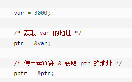

4. 指针作为返回值

这里返回的是 a/b 的地址

这里 a，b 不能是局部变量，需要时外部变量或 static 局部变量

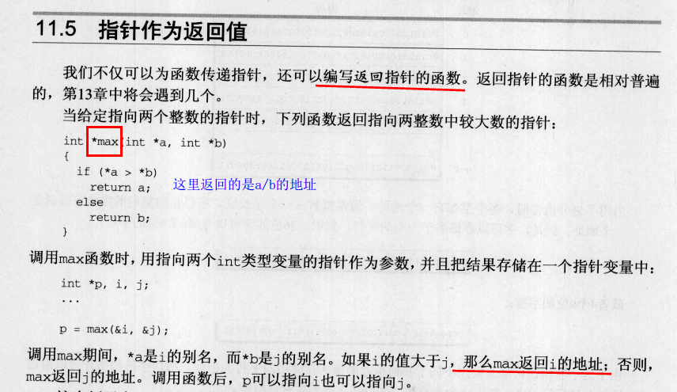

### const

C 语言定义数组不能使用 const 定义（C++可以），需要改成#define

```c
const int num = 10;
int a[num]; // error
#define num 10
int a[num]; // right
```

const 类和 const 成员函数

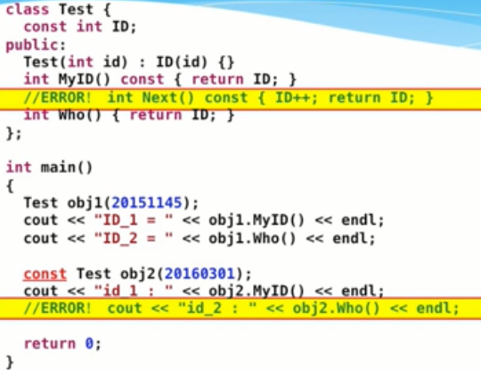

### 计算时间

```C++
#include<time.h>

clock_t start = clock();
clock_t end = clock();
std::cout << "Running time(s):" << (double)(end - start) / CLOCKS_PER_SEC << endl;
// CLOCKS_PER_SEC:CPU一秒钟运行的时钟周期数
```

### main 函数参数调用

可以在执行程序时，获取命令行的输入。

argc 表示输入的个数，输入用空格相隔。 argv[]储存输入的参数。

```c++
int main(int argc, const char *argv[]) {
  for (size_t i = 0; i < argc; i++) {
    std::cout << argv[i] << std::endl;
  }
  return 0;
}
```

输出结果：

```shell
g++ -o main main.cpp
./main 1 "hello" 1.233
# 输出
1
hello
1.233
```

### 内存释放

C 语言中是 free 函数，可以释放由 [malloc()](http://c.biancheng.net/cpp/html/137.html)、[calloc()](http://c.biancheng.net/cpp/html/134.html)、[realloc()](http://c.biancheng.net/cpp/html/2859.html) 分配的内存空间，以便其他程序再次使用。单纯静态数据的内存不能释放。类似于 C++中的 new 与 delete 操作。

```c
#include <stdlib.h>
free(ptr); // 释放内存，但不会改变指针的指向。
ptr = NULL; // 手动重置指针，防止误用。
```

### 右值引用&&

// 右值引用：https://www.ibm.com/developerworks/cn/aix/library/1307_lisl_c11/index.html

右值引用是用来支持转移语义*move semantics*的。

转移语义可以将资源 ( 堆，系统对象等 ) 从一个对象转移到另一个对象，这样能够减少不必要的临时对象的创建、拷贝以及销毁，能够大幅度提高 C++ 应用程序的性能。

临时对象的维护 ( 创建和销毁 ) 对性能有严重影响。

```c++
void process_lvalue(int& i) {
 std::cout << "LValue processed: " << i << std::endl;
}

void process_rvalue(int&& i) {
 std::cout << "RValue processed: " << i << std::endl;
}

int main() {
 int a = 0;
 process_lvalue(a);
 process_rvalue(1);
 process_rvalue(std::move(a));  // move semantics
}
// 结果
LValue processed: 0
RValue processed: 1
```

### 尾部返回类型标注

```cpp
// cpp_primer 7.4练习
// c++ trailing return type notation
auto get_name() const -> std::string const& { return name; }
// 其中std::string const&表示该函数的返回类型，相当于：
std::string const& get_name() {return name;}
```

## 数据结构

### 优先级队列

优先级队列的原理是堆，最大堆：每一个节点的值大于其子节点；最小堆相反。

头文件`#include <queue>`, 他和`queue`不同的就在于我们可以自定义其中数据的优先级, 让优先级高的排在队列前面,优先出队。

定义：`priority_queue<Type, Container, Functional>`
Type 就是数据类型，Container 就是容器类型（Container 必须是用数组实现的容器，比如 vector,deque 等等，但不能用 list。STL 里面默认用的是 vector），Functional 就是比较的方式，当需要用自定义的数据类型时才需要传入这三个参数，使用基本数据类型时，只需要传入数据类型，默认是大顶堆。

```c++
// 升序队列，最小堆
priority_queue <int,vector<int>,greater<int> > q;
// 降序队列，最大堆
priority_queue <int,vector<int>,less<int> >q;

// 自定义，重写仿函数，不能用lambda函数
struct cmp {
    // 相当于 greater<int>
    bool operator() (const int& a, const int& b) const { return a > b; }
};
std::priority_queue<int, std::vector<int>, cmp> q;
```

### unordered_map

> hash_map 库没有加入 c++11

C++ 11 标准中加入了[unordered](https://zh.cppreference.com/w/cpp/container/unordered_map)系列的容器。unordered_map 记录元素的 hash 值，根据 hash 值判断元素是否相同。map 相当于 java 中的 TreeMap，unordered_map 相当于 HashMap。

时间复杂度：unordered_map>hash_map>map。空间复杂度：hash_map<unorderd_map<map

**unordered_map 与 map 的对比：**

unordered_map 存储时是根据 key 的 hash 值判断元素是否相同，即内部元素是无序的，而 map 中的元素是按照二叉搜索树存储（用红黑树实现），进行中序遍历会得到有序遍历。所以使用时 map 的 key 需要定义 operator<。而 unordered_map 需要定义 hash_value 函数并且重载 operator==。但是很多系统内置的数据类型都自带这些。

总结：结构体用 map 重载<运算符，结构体用 unordered_map 重载==运算符。

**unordered_map 与 hash_map 对比：**

unordered_map 原来属于 boost 分支和 std::tr1 中，而 hash_map 属于非标准容器。
unordered_map 感觉速度和 hash_map 差不多，但是支持 string 做 key，也可以使用复杂的对象作为 key。
unordered_map 编译时 gxx 需要添加编译选项：--std=c++11

**迭代器**

```C++
#include <unordered_map>
unordered_map<key, T>::iterator it;
(*it).first;
(*it).second;
```

**insert 元素**

```c++
#include <string>
#include <iostream>
#include <unordered_map>

int main ()
{
    std::unordered_map<int, std::string> dict = {{1, "one"}, {2, "two"}};
    dict.insert({3, "three"});
    dict.insert(std::make_pair(4, "four"));
    dict.insert({{4, "another four"}, {5, "five"}});

    bool ok = dict.insert({1, "another one"}).second;
    std::cout << "inserting 1 -> \"another one\" "
              << (ok ? "succeeded" : "failed") << '\n';

    std::cout << "contents:\n";
    for(auto& p: dict)
        std::cout << " " << p.first << " => " << p.second << '\n';
}
// inserting 1 -> "another one" failed
// contents:
// 5 => five
// 2 => two
// 1 => one
// 3 => three
// 4 => four
```

**删除元素**

使用 erase，删除元素可以直接传入被删除元素和 key，也可以传入被删除元素的 iterator。

#### 其它同类数据结构

其它类似的数据结构包括：

- unordered_set：无序集合。

- set 和 map 为对应有序集合和映射。

## OOP 语法

### 1. 类成员的访问权限

- 对于 private 成员，可以通过声明类的友元函数，进行访问。但是不推荐，会破坏类的封装性。

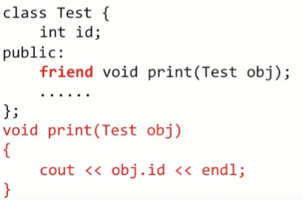

### 2. 构造与析构

#### 委派构造函数：

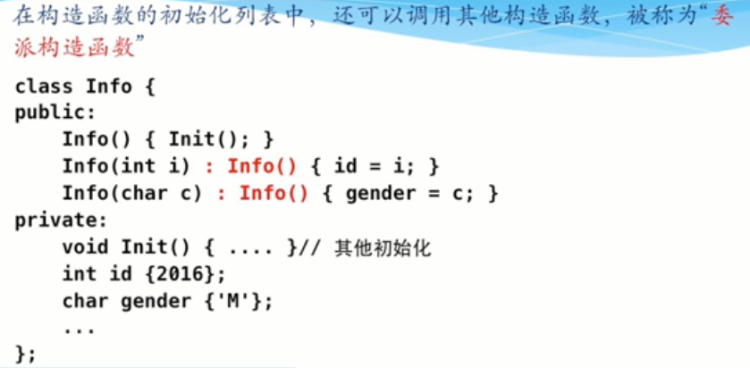

#### 移动构造函数

```c++
ClassName(ClassName&& ); // 右值引用，用来偷取临时变量中的资源，如内存
```

作用：将 t.buff 中的内容转移至新对象，同时将 t.buff 的指针置为空。（当拷贝对象较大时建议使用移动拷贝构造函数。）

否则两个指针指向同一内存，当其它一指针的内存释放时候，另一指针的操作会导致程序崩溃。

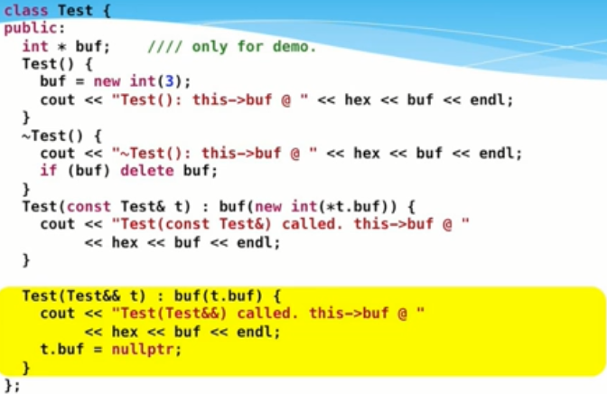

```c++
MyMovableClass(MyMovableClass &&source)  // 4 : move constructor
{
  _data = source._data;
  _size = source._size;
  source._data = nullptr;
  source._size = 0;
}

// 下面的功能与上面相同
MyMovableClass &operator=(
    MyMovableClass &&source)  // 5 : move assignment operator
{
  if (this == &source) return *this;

  delete[] _data;

  _data = source._data;
  _size = source._size;

  source._data = nullptr;
  source._size = 0;

  return *this;
}
```

#### default 修饰

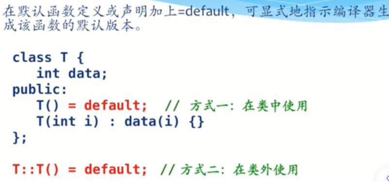

### 3. 重载

#### 流运算符

常将其声明为类得友元函数，访问类的私有变量。

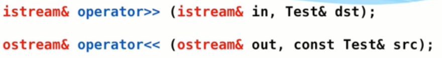

```c++
istream& operator>> (istream& in, Test& dest) {
  in >> dest.id; // dest的私有变量
  return in;
}

ostream& operator<< (ostream& out, const Test& src) {
  out << src.id;
  return out;
}
// main
Test obj;
cin >> obj;
cout << obj;
```

#### 运算符重载

- 1、运算重载符不可以改变语法结构。
- 2、运算重载符不可以改变操作数的个数。
- 3、运算重载符不可以改变优先级。
- 4、运算重载符不可以改变结合性。

```c++
// 语法
类型 operator 被重载运算符（类型 变量）
// 重载+
Box operator+(const Box&, const Box&);
// 重载[]
int& operator[](int i)
{
  if( i > SIZE ){
    cout << "索引超过最大值" <<endl;
    // 返回第一个元素
    return arr[0];
    }
  return arr[i];
}
```

#### 函数运算符（）重载

对"()"进行重载

```c++
// 在类中定义
ReturnType operator() (parameters) {}
// 调用
ClassName obj;
obj(rear parameters);
// obj.operator() (rear parameters);
```

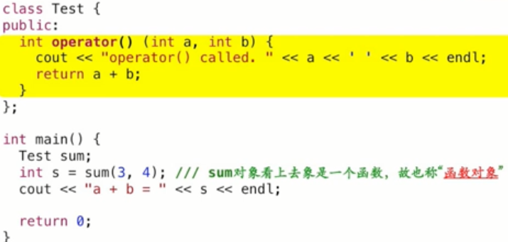

### 4. 继承

继承通常是 public 和 private，缺省情况下是 private。

构造顺序：先基类后派生类；析构顺序：先派生类后基类。

可以使用`using Base::Bass;` 来继承基类的构造函数，这是派生类不会自动生成构造函数。

| 基类成员     | public  | private                          | protect |
| ------------ | ------- | -------------------------------- | ------- |
| public 继承  | public  | 调用基类的公有和保护成员函数访问 | protect |
| private 继承 | private | no                               | private |
| protect 继承 | protect | no                               | protect |

成员函数或变量是否可以直接访问，如：`Base.func()`
| 访问 | public | protected | private |
| :------- | :----- | :-------- | :------ |
| 同一个类 | yes | yes | yes |
| 派生类 | yes | yes | **no** |
| 外部的类 | yes | no | no |

#### 4.1 override 覆盖/重写

派生类中定义的虚函数，如果与基类中定义的同名**虚函数有相同的形参列表**，则派生类版本将覆盖基类的版本。

override 之后，基类同名的函数被屏蔽，但可以使用`using Base::func()`使用

```c++
struct B {
    virtual void f1(int) const;
    virtual void f2();
    void f3();
}

struct D1 : B {
    void f1(int) const override;
    void f2(int) override; // error, 形参不一致
    void f3() override; // error, f3不是虚函数
    void f4() override; // B中无f4函数
}
```

#### 4.2 虚函数

**映射关系**

向上映射：派生类向基类转化（由编译器自动完成的隐式转换），此时可以使用基类的函数。

```c++
class Base {
 public:
  void print() { cout << "Base print" << endl; }
};

class Derived : public Base {
 public:
  void print() { cout << "Derived print" << endl; }
};

void func(Base obj) { obj.print(); }

int main() {
  Derived d;
  d.print();  // Derived print
  func(d);    // Base print, 派生类向上映射，调用的是基类的print函数，调用派生类需要用虚函数方式
  return 0;
}
```

**虚函数**：

当在基类中被声明为虚函数，通过基类指针或引用该成员函数时，编译器根据所指或被引用对象的实际类型，决定调用基类函数还是派生类函数，即**多态**功能。

```c++
class Base {
 public:
  // 修改位置
  virtual void print() { cout << "Base print" << endl; }
};

class Derived : public Base {
 public:
  void print() { cout << "Derived print" << endl; }
};

// 修改位置
void func(Base& obj) { obj.print(); }

int main() {
  Derived d;
  d.print();  // Derived print
  func(d);    // Derived print
  return 0;
}
```

**final：禁止虚函数重写** c++11 标准

```c++
class A {
  public:
    virtual void func() = 0;
};
class B: public A {
  public:
    void func() final; // 到此为止，后续子类不能重写此接口函数。
}
class C: public B {
  public:
    void func(); // 出错
}
```

纯虚函数：定义纯虚函数的类不能定义对象，只作为接口类。

`virtual void func() = 0;`

**析构问题**：

当 new 派生类，并被基类指针所指时`B* ptr = new D;`：

基类析构函数需要定义成虚析构函数，保证先析构派生类再析构基类，防止出现资源泄露。

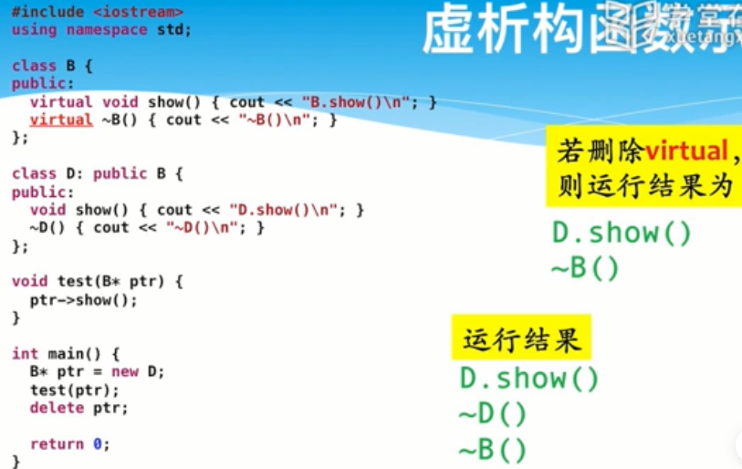

### 5 类型转换

#### 5.1 自动类型转换

src 源类--->dst 目标类

方法 1：在 src 类中定义目标类型转化运算符

```c++
class Dst {
  public:
  Dst();
};
class Src {
  public:
  Src();
  explicit operator Dst() const {...} // 禁止自动类型转换
  operator Dst() const {
    // ...
    return Dst;
  }
};
```

方法 2：在 dst 中定义源类对象作参数的构造函数

```c++
class Dst {
  public:
  Dst();
  // explicit Dst(const Src& s); // 禁止自动类型转换
  Dst(const Src& s);
};
class Src {
  public:
  Src();
};

void Func(Dst d) {}

int main(void) {
  Src s;
  Dst d1(s); // 直接构造

  Dst d2 = s; // 自动类型转换，区别：拷贝构造函数时同类型对象
  Func(d2);   // 自动类型转换
}
```

#### 5.2 禁止自动类型转换

除了 explicit，还可以用 C++11 的新功能 delete

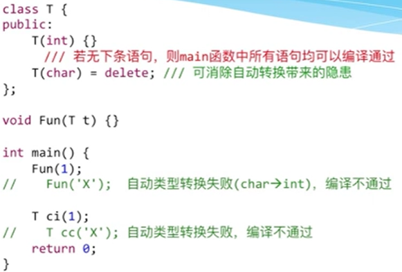

#### 5.3 强制类型转换

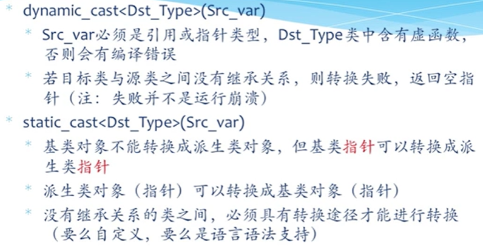

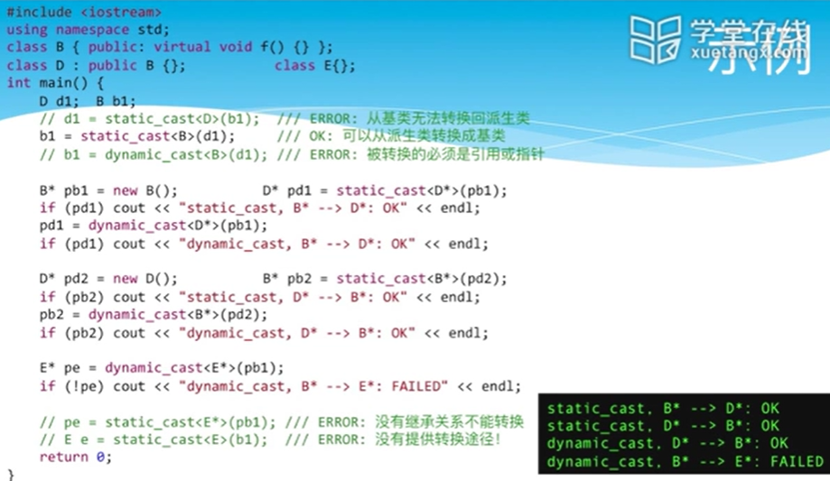

### 6. 模板

#### 6.1 函数模板

避免函数重载带来的重复工作。不同于函数重载，模板函数只写了 1 次，而函数重载至少 2 次。

```c++
template<typename 数据类型参数标识符>
<返回类型><函数名>(参数表)
{
    函数体
}
// 数字交换函数模板
template<typename T> T swap(T x, T y);
// compare
template<typename T> int compare(const T& x, const T& y);
// 数据类型也可以使用默认值
template<typename T0=float, typename T1, typename T2=float,
         typename T3, typename T4>
T0 func(T1 v1, T2 v2, T3 v3, T4 v4) {...}
```

#### 6.2 类模板

类模板本身不能定义对象，因为其对象不确定。但编译器会自动将其实例化，之后才能定义对象。

在类模板外定义成员函数与普通成员函数不同，需要注意：

1. 方法一：在头文件末尾增加实现部分.cpp 文件，如`#include "foo.tpp"`，注意是 tpp 文件

2. 方法二：在.cpp 文件末尾增加实例版本。只有实例化的版本才能被使用——因为只有它们真正被编译成了类代码；其它未实例化的版本，实际是没有定义的类。如：

   ```c++
   // .cpp中
   // 只能使用int和double模板类型的类
   template class Bar<int>;
   template class Bar<double>;
   ```

```c++
template <typename T> class class-name {
  public:
  // 在类内定义成员函数，需要再额外加template <typename T>
  T& func();
}

// 例如
template <typename T> class Blob {};
// 在类外定义成员函数，需要加上template <typename T>
template <typename T> T Blob<T>::func();
// 返回类型为引用或指针
template <typename T> T& Blob<T>::func();

// 调用时
class class-name<类型> 类变量
// 例如,类中以T&为类型的，会被替换成int
class Blob<int> name
```

类模板参数：

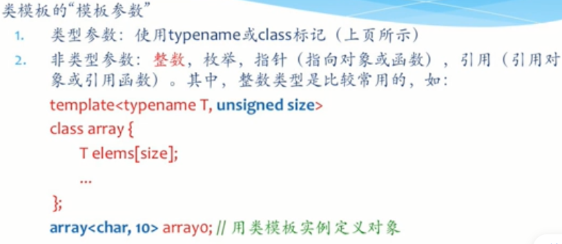

类模板参数是另一个类模板：

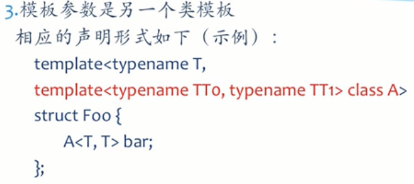

#### 6.3 成员函数模板

除了使用模板类的模板参数，类的成员函数还可以定义额外的函数参数。

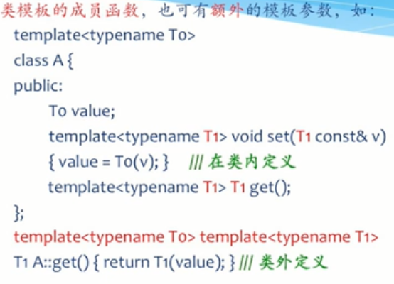

#### 6.4 模板的特殊化

由于一个模板不可能适用于所有类型，则需要对模板进行特殊化处理。

**函数模板的特化**：需要在原函数模板的基础上增加特化函数。

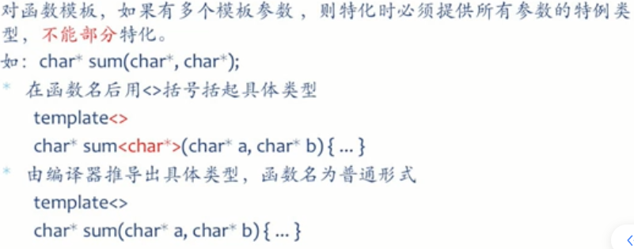

增加特化函数：

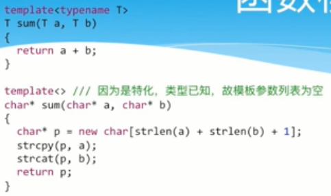

**对类模板的特化**

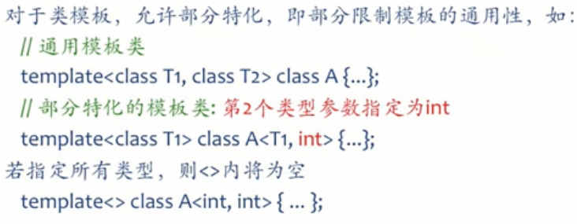

增加特化类模板

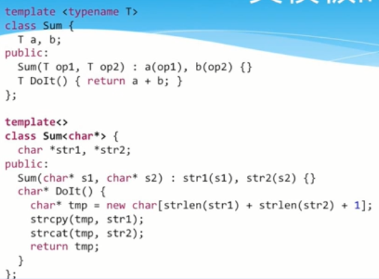

## OOP 设计

开闭原则：开放新功能，闭尽量不修改原有代码。

### 1. 找到对象，确定接口

引出对象，确定对象边界：封装什么，暴露什么，隐藏什么。

UML 类图：分类对象关系，类的属性（隐藏与接口部分）等。

**步骤：**

1. 根据功能，确定不变部分与可变部分。

2. 确定接口：从上到下设计。

   - 期待类所实现的功能

   - 根据期待的方法设计接口（最基本接口）

   - 确定成员变量

3. 接口实现
   - 实现构造，析构等其它成员函数。
   - 实现必要的细化函数。
4. 变与不变

   - 多态，适当定义接口类。

   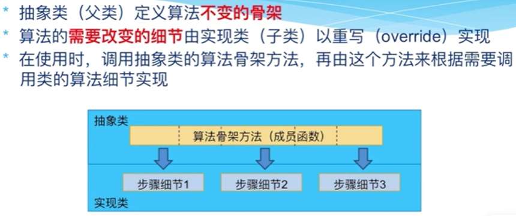

**步骤 2：**

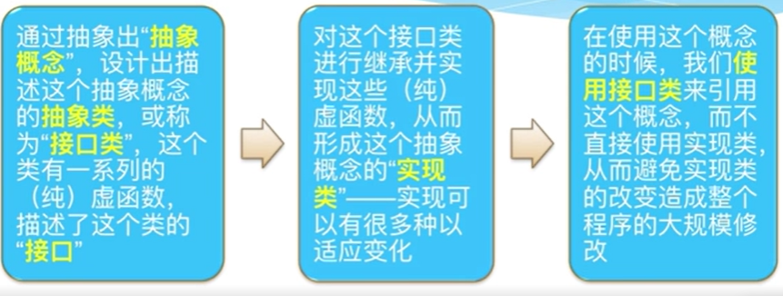

### 2. 算法横向拆分

单一制原则：类的功能是内聚的，一个类只承担一种功能。表现为：修改/派生一个类只应该有一个理由，只能够由单个变化因素引起。

**委托模式**

**Bridge 模式**

### 3. 算法纵向拆分

将算法与数据拆分，如：使用同一接口对不同存储形式的数据访问（Iterator）。类似泛型编程：先实现算法，再充实数据表示。

#### 迭代器模式

提供一种方法顺序访问一个聚合对象中的各个元素。

不暴露该对象的内部表示-与对象的内部表示无关。

```c++
for (Iterator p = begin; p != end; p++) {
  // do sth with *p
}
```

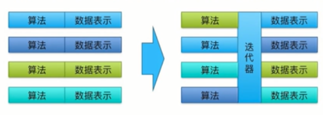

容器：存储数据，数据的表示

算法：处理数据，抽象的算法实现。

迭代器：标准的数据遍历接口，隔离算法与容易，使算法与数据的表示无关。

**实现通用的算法，使得数据与算法解耦。**

- 算法仅与可用操作相关，抛开具体类型考虑算法，实现抽象运算，在算法与数据类型（存储）之间实现解耦。
- 在 C++中，可用操作是指操作符（\*, ++, !=, >=），依赖于运算符重载，可用的操作是数据类型的抽象接口。

#### 抽象结构

利用抽象结果与类模板，实现特定的数据结构：list，vector，stack...

#### 函数对象

对象 = 数据 + 函数， 把函数放在数据中。

对象 = 函数 + 数据，把数据放在函数中，函数调用相当于 ()操作符重载，实现函数对象。

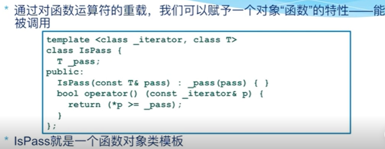

#### STL

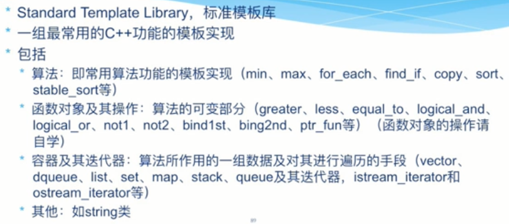

### 4. 程序复用

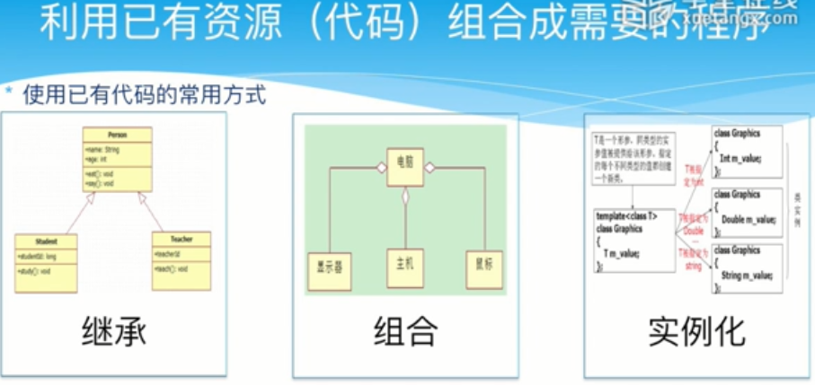

继承：利用多态实现功能的“变”。

组合：使用更加灵活，推荐使用组合而不是继承。

模板实例化（泛型编程）

#### 适配器模式

1. 可以利用数组或 STL 中的 vecctor 实现 stack

2. 将 stack 定义为抽象类，子类继承并用不同的方法实现。有利于明确抽象界限，保证不同的模块的接口一致。

   相当于在 vector 与 stack 之间增加了一种适配器类（Adapter Class）。

   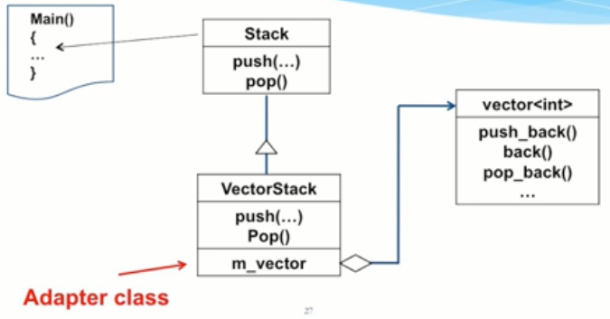

#### 装饰模式

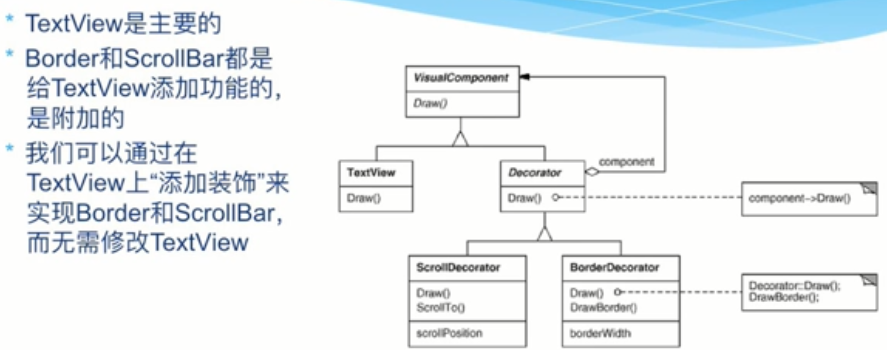

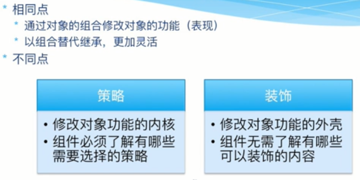

#### 责任链模式与装饰模式

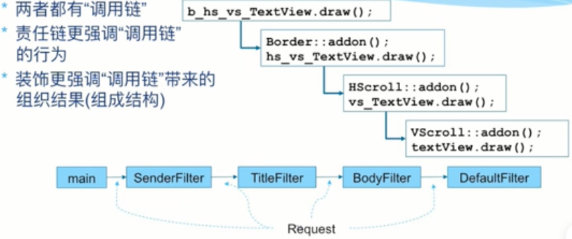

### 5. 增加抽象层级，隔离

- 通过封装增加隔离（多态的运用）

  简单工厂模式：封装创建选择，屏蔽实现细节

  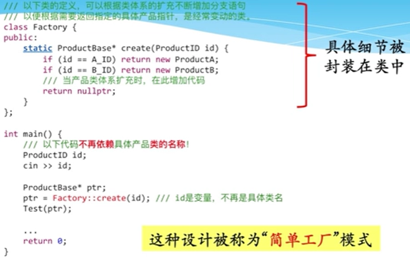

- 派生：增加抽象层，增强灵活性。（双层多态：工厂+产品）

  工厂方法模式

  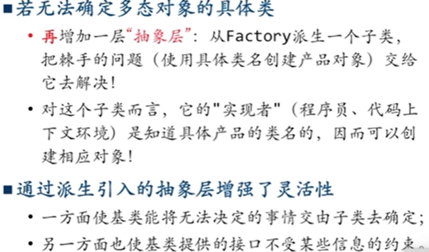

- 关联对象创建

  抽象工厂模式：将关联对象生成接口集成到单个创建类中，在实现该类时保证各个对象之间的关联性符合要求。

  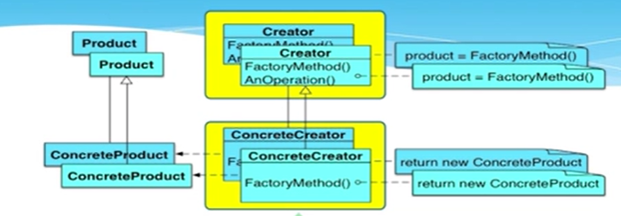

#### 案例：自动组卷系统

要求：从题库中抽取题目，生成试卷。

Builder 设计模式。

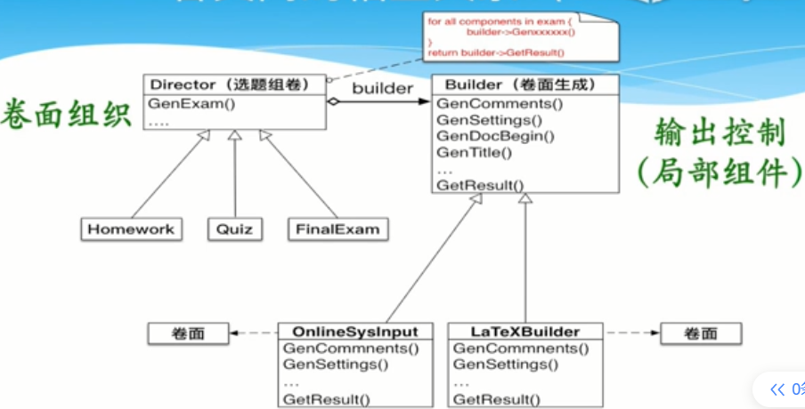

## 回调函数

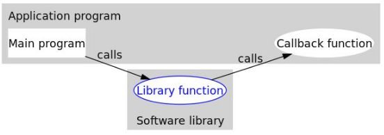

一般程序运行时，应用程序会常常通过 API 调用库里所预先准备好的函数。 但是有些库函数却要求应用程序先传给它一个函数，以在合适的时候调用完成任务。这个被传入的、后又被调用的函数就称为**回调函数**（callback function）。

个人理解：中间函数（库函数）通常都是封装好了，只提供了对应的 API，API 中具有回调功能。这样通过应用层面自己编写回调函数，就会比什么函数都封装在中间函数里面更灵活。

左边的 call：把回调函数传入库函数的动作，称为登记回调函数。下方代码中传入 getDouble 或 getQuadruple 函数。

右边的 call：响应回调函数。下方代码中(\*getEvenNumber)调用 getDouble 或 getQuadruple 函数。

```c++
int getDouble(int x) {
  return x * 2;
}

int getQuadruple(int x) {
  return x * 4;
}

// 第二个参数传入函数
int getOddNumber(int x, int (*getEvenNumber)(int x)) {
  return 1 + (*getEvenNumber)(x);
}

int main(int argc, const char *argv[]) {
  int x = 3;
  std::cout << "x is:" << x << std::endl;

  // 生成2k+1奇数
  std::cout << "2 Times odd number is:" << getOddNumber(x, getDouble) << std::endl;

  // 生成4k+1奇数
  std::cout << "4 Times odd number is:" << getOddNumber(x, getQuadruple) << std::endl;

  return 0;
}
```

输出：

```shell
x is:3
2 Times odd number is:7
4 Times odd number is:13
```

### 面向对象 Callback

本 Case 为 Boss 读取并设置财务数据。

其中，Boss 为应用程序，Fiance 为中间函数，而 CallBack 为回调函数类。

1. CallBack 定义了一个接口，需要在应用对象 Application 函数中重写实现。
2. 当 Application 调用库函数（里面有 callback 函数）时，需要将 Application 传入库函数，以便调用回调函数。

```C++
// 参考https://blog.csdn.net/qq_29924041/article/details/74857469

#include <iostream>

// 回调函数类
class CallBack {
  public:
  virtual int getEvenNumber(int x) const = 0;
};

// 库函数类
class Compute {
  public:
  // ! 调用Application中重写的回调函数
  Compute(CallBack *mcallback)
      : mcallback_(mcallback) {
  }
  ~Compute() {
  }

  // 被调用的库函数
  int getOddNumber(int x) {
    int temp = 0;
    if (mcallback_ != NULL) {
      temp = mcallback_->getEvenNumber(x);
    }
    return 1 + temp;
  }

  private:
  CallBack *mcallback_;
};

// 应用函数类
class Application : public CallBack {
  public:
  Application() {
    // ! 关键，将自身传入库函数，相当于登记回调函数。
    mcompute_ = new Compute(this);
  }
  ~Application() {
    if (mcompute_ != NULL) {
      delete mcompute_;
      mcompute_ = NULL;
    }
  }

  // 编写函数调用库函数
  void getNumber(int x) {
    int res = mcompute_->getOddNumber(x);
    std::cout << res << std::endl;
  }

  // 自定义回调函数，可以是2×k，4×k等。
  int getEvenNumber(int x) const {
    // return x * 2;
    return x * 4;
  };

  private:
  Compute *mcompute_;
};

int main(int argc, const char *argv[]) {
  int x = 3;

  Application test;

  test.getNumber(x);

  return 0;
}
```

## 多线程

多线程是多任务处理的一种特殊处理形式，多任务处理允许让电脑同时运行两个或两个以上的程序。通常分为：基于进程或基于线程。

<https://www.bogotobogo.com/cplusplus/multithreading_pthread.php>

```c++
#include <pthread.h>
// 创建线程
pthread_create (thread, attr, start_routine, arg);
// 退出线程
pthread_exit(status);
```

## Pytorch CPP

文档：[C++ Pytorch Doc](https://pytorch.org/docs/stable/cpp_index.html)

开发工具：CLion

Basic CMakeLists.txt file：

> 注意：将`-DCMAKE_PREFIX_PATH=/absolute/path/to/libtorch`加入 cmake 编译选项中。

```cmake
cmake_minimum_required(VERSION 3.0 FATAL_ERROR)
project(example-app)

find_package(Torch REQUIRED)
set(CMAKE_CXX_FLAGS "${CMAKE_CXX_FLAGS} ${TORCH_CXX_FLAGS}")

add_executable(example-app example-app.cpp)
target_link_libraries(example-app "${TORCH_LIBRARIES}")
set_property(TARGET example-app PROPERTY CXX_STANDARD 14)

# The following code block is suggested to be used on Windows.
# According to https://github.com/pytorch/pytorch/issues/25457,
# the DLLs need to be copied to avoid memory errors.
if (MSVC)
  file(GLOB TORCH_DLLS "${TORCH_INSTALL_PREFIX}/lib/*.dll")
  add_custom_command(TARGET example-app
                     POST_BUILD
                     COMMAND ${CMAKE_COMMAND} -E copy_if_different
                     ${TORCH_DLLS}
                     $<TARGET_FILE_DIR:example-app>)
endif (MSVC)
```

## 常见错误

- g++编译时出现问题。

  原因及解决办法：主要是没有在 cpp 文件中实现构造函数和析构函数。(空的构造函数也要写，不能只在 h 文件中实现。)

  main.o: In function `main':

  main.cpp:(.text+0x20): undefined reference to 构造函数和析构函数
