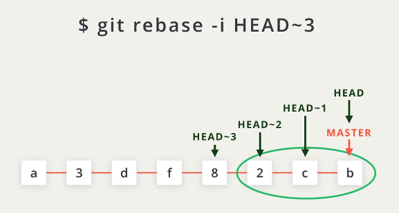

# Git 学习笔记

## 基本操作

### concept

- 工作区/版本库（包括暂存区和分支）

- stage: temporary storage.暂存区。

- branch: incuding master, and others 分支.

- origin: github repository name, which can be modified.


### command

- git add : add file
- git commit -m "xxx" : commit file with a comment
- git reset --hard HEAD^ : return back to last version.版本库
- git reset --hard HEAD~100 : return back to last 100th version.
- git reset --hard 'commit id': retun to specific version. 
- git reflog: 记录每一次命令。
- git diff HEAD -- file_name: 查看file_name文件工作区与版本库的区别。可以用^查看版本库上一个版本。
- git checkout -- file_name: 撤销工作区的修改。针对没有提交到暂存区的修改。
- git reset HEAD file_name: 撤销暂存版本。
- git rm file_name, then commit: delete 版本库和工作区的文件
- git rm -r --cached file_name + git commit : 取消对文件进行git记录，配合.gitignore使用

### 远程库
- creat ssh key and connect github
    ```sh
    # 生成ssh key，位置在 ~./ssh
    ssh-keygen -t rsa -C "youremail@example.com"
    ```
- git remote rm orgin: 取消当前origin的连接。
- git remote add origin [ssh link]: connect repository.
- git push -u origin master: push files to origin repository.
- git clone [ssh link]: 克隆，ssh速度较http快
- git push origin [branch]: 推送分支到远程。
- git remote -v: 查看远程库信息，本地新建的分支如果不推送到远程，对其他人就是不可见的；
- git push origin [branch]: 从本地推送分支，如果推送失败，先用git pull抓取远程的新提交；
- git checkout -b [branch] origin/[branch]: 在本地创建和远程分支对应的分支，本地和远程分支的名称最好一致；
- git branch --set-upstream [branch] origin/[branch]：建立本地分支和远程分支的关联
- 从远程抓取分支，使用git pull，如果有冲突，要先处理冲突。
- git remote rename origin mine: 将远程仓库更名为“mine”

### Fork
- fork:从其它用户的仓库克隆到自身仓库，可以自由操作。如果需要合并到原来仓库实现协同工作，可以使用pull request命令。

- 同步更新原仓库内容：使用New pull request进行对比，注意箭头base fork和head fork方向。若需要更新对方内容，head为对方仓库。

- 添加原仓库的url，注意fork后origin表示的是自己这边的仓库，不是原仓库。

  ```bash
  # upstream表示原始库，url为对应地址。
  git remote add upstream url
  # 拉取原仓库代码合并到自己本地的仓库master
  git pull upstream master
  # 更新自己的远程库
  git push prigin master
  ```


### 分支管理
分支管理可以在原来主线上生成，新生成的分支不影响主线，分支可以随时合并上去，速度极快。  
在分支上修改，必须合并之后到master，才能在master上体现。  
注意master应该是非常稳定的，通常最好在分支下操作，版本发布才同步到master上。
- git checkout -b [branch]: 新建分区并切换。

- git branch [branch]: 新建分区。

- git checkout [branch]: 切换分区。

- git branch: 查看所有分区。

- git merge [branch]: 合并分支。

- git merge --no-ff [branch]: 不使用fast forward合并，否则会丢失分支信息。

- git branch -d [branch]: 删除分支。

- git branch -D [branch]: 强行删除没有合并的分支。

- 分支与主分支均有修改，在合并上容易出现冲突，需要单独解决才能合并merge。

- git stash: 在某一个分支上修改的内容，没有commit直接跳转到其它分支，会把当前分支修改的内容带到下一个分支，需要在直接commit或者临时储存现场。

- git stash list: 查看储存列表。

- git stash apply: 恢复现场，但不清理stash。

- git stash drop: 删除储存stash 

- git stash pop: 恢复并删除。

#### 远程分支

- 查看远程分支。git branch -r

- 删除远程分支

  git branch -r -d origin/[branch]

  git push origin: [branch]

### tag
- git tag [name]：设置标签，对应的是commit，默认HEAD，也可以指定对应的commit id。
- git tag：查看标签
- git tag -a [tagname] -m "blablabla..."：指定标签信息。

## 提交规范

参考：<http://www.ruanyifeng.com/blog/2016/01/commit_message_change_log.html>

每次提交，Commit message 都包括三个部分：Header，Body 和 Footer。

Header只能是下面7个类别：

- feat：新功能（feature）
- fix：修补bug
- docs：文档（documentation）
- style： 格式（不影响代码运行的变动）
- refactor：重构（即不是新增功能，也不是修改bug的代码变动）
- test：增加测试
- chore：构建过程或辅助工具的变动

### 进阶操作

### 压制commit：git rebase

- 将最后3个commit合并。



