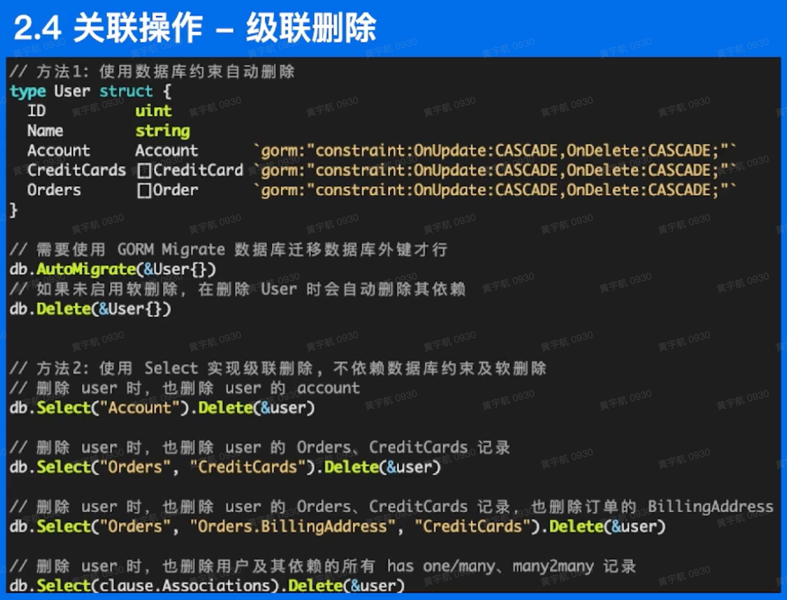
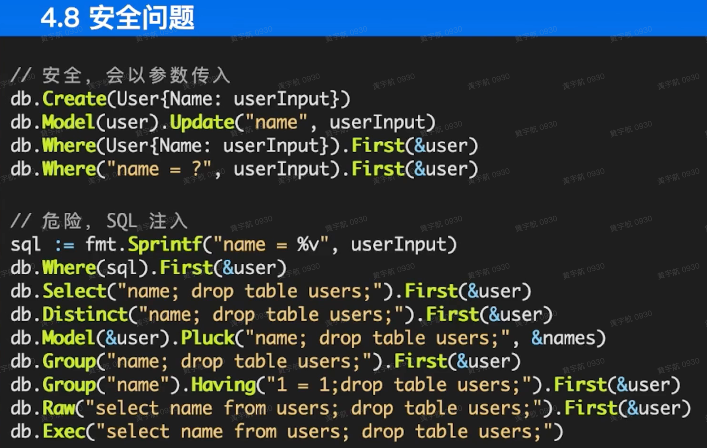

# Golang

## context

[context基础](https://mp.weixin.qq.com/s?__biz=MzUzNTY5MzU2MA==&mid=2247484364&idx=1&sn=31dcd520b7d938f77a04ea79971464c0&chksm=fa80d25bcdf75b4de325fd57fca98198327250e31626ac7339e0141821e153b7579bb4eb94ee&token=298412984&lang=zh_CN#rd)

[context取消goroutine](https://zhuanlan.zhihu.com/p/136664236)

Go 语言中的每一个请求的都是通过一个单独的 Goroutine 进行处理的，HTTP/RPC 请求的处理器往往都会启动新的 Goroutine 访问数据库和 RPC 服务，我们可能会创建多个 Goroutine 来处理一次请求，而 `Context` 的主要作用就是在不同的 Goroutine 之间同步请求特定的数据、取消信号以及处理请求的截止日期。

每一个 `Context` 都会从最顶层的 Goroutine 一层一层传递到最下层，这也是 Golang 中上下文最常见的使用方式，如果没有 `Context`，当上层执行的操作出现错误时，下层其实不会收到错误而是会继续执行下去。

当最上层的 Goroutine 因为某些原因执行失败时，下两层的 Goroutine 由于没有接收到这个信号所以会继续工作；但是当我们正确地使用 `Context` 时，就可以在下层及时停掉无用的工作减少额外资源的消耗：


 Golang 中上下文的最大作用：在不同 Goroutine 之间对信号进行同步避免对计算资源的浪费，与此同时 `Context` 还能携带以请求为作用域的键值对信息。

## web

[无闻 golang web 教学](https://studygolang.com/subject/479)

## gopath

gopath 设置：`go env -w GOPATH=path to you project`

当前 workspace 目录：

```shell
$ hyh in ~/developer/chat λ tree . -L 2
├── bin
│   ├── chat
│   ├── dlv
│   ├── dlv-dap
│   ├── go-outline
│   ├── gopkgs
│   ├── gopls
│   └── staticcheck
├── pkg  # dependecy packages
│   ├── mod
│   └── sumdb
└── src  # source code with go.mod
    ├── go.mod
    ├── go.sum
    ├── main.go
    └── utils  # your other codes
```

### 常用命令

```shell
# init go.mod in your src
cd src
go mod init <your developement>


# download some dependencies in your source codes
go mod tidy

# clean mod dependencies cache
go clean -modcache

# install developement and generate binary executions to bin folder
cd src
go install <your developement>

# execute your developnment
cd bin
./<your developement>
```

## Gorm

- 关联模式

  

- 安全

  

  **原因：[Gorm 和 Go 端的 SQL 预编译](https://blog.csdn.net/qq_39384184/article/details/108144309)**

  在 Gorm 中，就为我们封装了 SQL 预编译技术，可以供我们使用。

  ```cgo
  db = db.Where("merchant_id = ?", merchantId)
  ```

  在执行这样的语句的时候实际上我们就用到了 SQL 预编译技术，其中预编译的 SQL 语句merchant_id = ?和 SQL 查询的数据merchantId将被分开传输至 DB 后端进行处理。

  ```cgo
  db = db.Where(fmt.Sprintf("merchant_id = %s", merchantId))
  ```

  而当你使用这种写法时，即表示 SQL 由用户来进行拼装，而不使用预编译技术，随之可能带来的，就是 SQL 注入的风险。

## 发布

- [golang发布自己的pkg](https://blog.csdn.net/MrKorbin/article/details/111032300)
